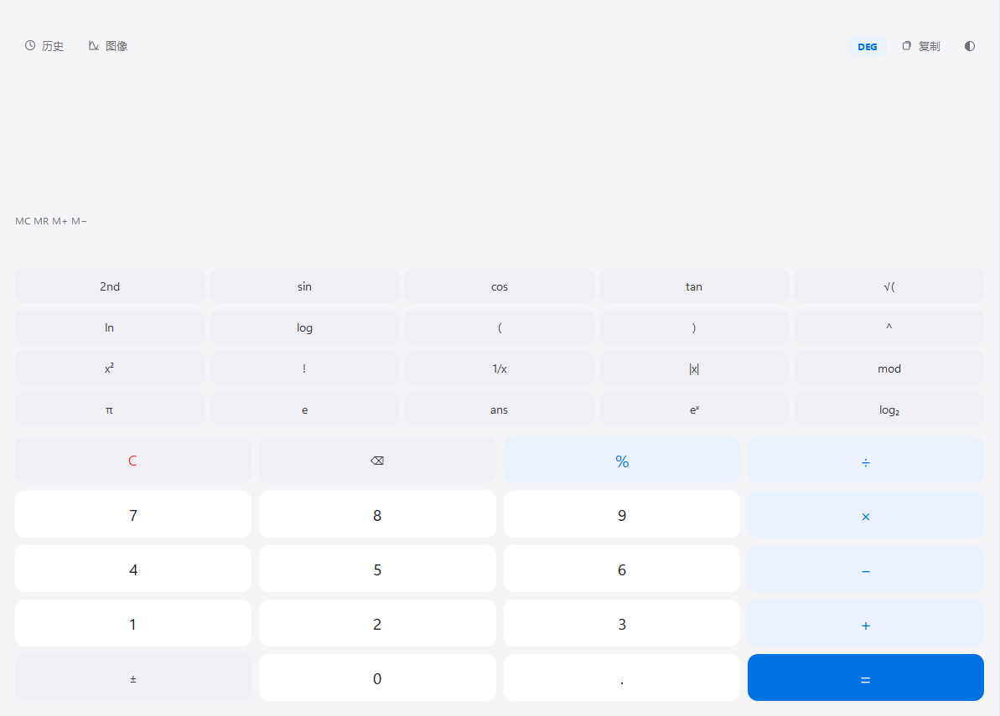
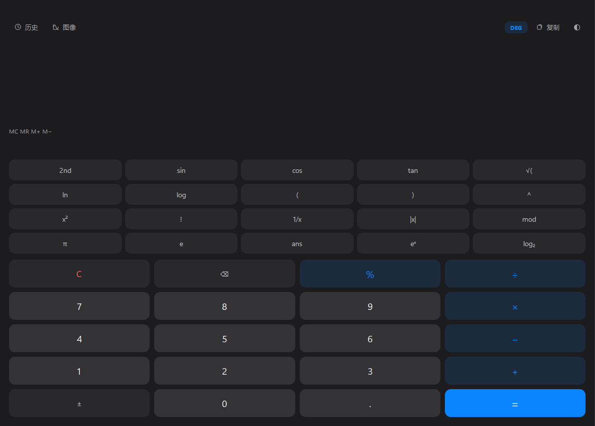
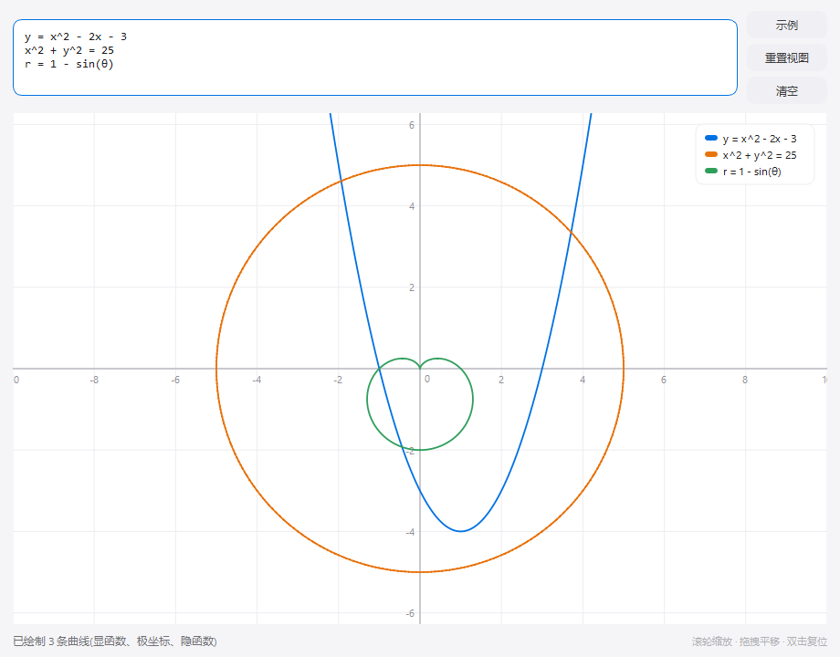
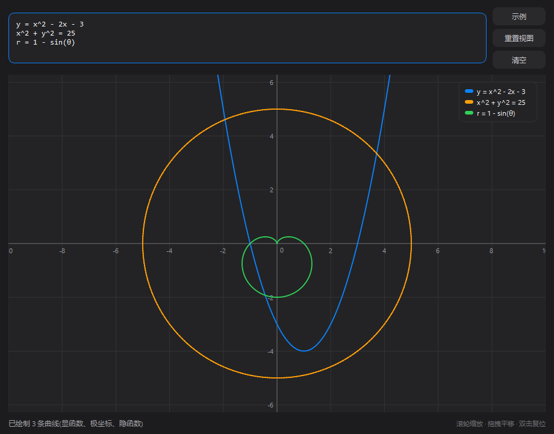

# 科学计算器

一个用 Python + PySide6 编写的桌面科学计算器:极简扁平界面,浅色 / 深色双主题(默认浅色),支持历史记录、内存运算、实时预览、全键盘操作,以及**函数图像绘制**。

## 界面预览

| 计算器(浅色) | 计算器(深色) |
| --- | --- |
|  |  |

| 函数图像(浅色) | 函数图像(深色) |
| --- | --- |
|  |  |

## 运行

```bash
pip install PySide6
python main.py
```

需要 Python 3.10+(在 Python 3.14 + PySide6 6.11 下开发测试)。

## 功能一览

- **基础运算**:`+ − × ÷`、括号、小数、百分比(`%` 为百分比后缀,取模请用 `mod`)
- **科学函数**:`sin cos tan`(2nd 切换反三角)、`ln log log₂`、`√ ∛`、`x² x³`、`xʸ`、`x!`(阶乘)、`1/x`、`|x|`、`eˣ`、`mod`
- **常量与变量**:`π`、`e`、`ans`(上次结果)、`m`(内存值)
- **角度模式**:DEG / RAD 一键切换(顶栏),影响三角与反三角
- **隐式乘法**:`2π`、`3(4+5)`、`2sin30` 可以直接写
- **历史记录**:侧栏展示,单击条目回填表达式;自动持久化(最多 200 条)
- **内存运算**:`MC / MR / M+ / M−`,显示区右侧有 `M = …` 徽标
- **实时预览**:输入过程中即时显示计算结果(灰色)
- **智能防呆**:连按运算符自动替换;`⌫` 按记号删除(函数名整体删,数字逐位删)
- **主题**:浅色 / 深色一键切换,选择会被记住
- **容错提示**:除零、定义域、语法错误等给出中文提示,表达式保留可修改
- **函数图像**:点击工具栏「图像」打开绘图窗口,自动识别并绘制显函数 / 隐函数 / 参数方程 / 极坐标(详见下文)

## 函数图像

点击工具栏的「图像」按钮打开绘图窗口。输入框里**每行写一条曲线**,输入后自动重绘(无需点按钮);
曲线类型由表达式自动识别,不需要手动选择。

| 类型 | 写法 | 示例 |
| --- | --- | --- |
| 显函数 | 裸表达式或 `y = f(x)` | `y = 2x + 1`、`y = x^2 - 2x - 3`、`y = x^3 - 3x`、`y = sin(x)`、`y = 1/x` |
| 隐函数 | 含 `y` 的等式 `F(x,y) = 0` | `x^2 + y^2 = 25`(圆)、`x^2/9 + y^2/4 = 1`(椭圆)、`x^2/4 - y^2/9 = 1`(双曲线)、`y^2 = 2x`(抛物线) |
| 参数方程 | `x=f(t), y=g(t)` | `x = 3cos(t), y = 2sin(t)`、`x = sin(3t), y = sin(4t)`、`x = t - sin(t), y = 1 - cos(t)` |
| 极坐标 | `r = f(θ)` | `r = 1 - sin(θ)`(心形线)、`r = 2cos(3θ)`(玫瑰线)、`r = θ/2`(螺线) |

- **参数范围**:参数方程与极坐标可追加范围后缀,如 `x=cos(t), y=sin(t), t=-6.28..6.28`、
  `r=θ/2, θ=0..12.57`;范围两端可以是常量表达式(`2π`、`π/2` 等)。默认范围:参数方程 `t∈[-2π, 2π]`,极坐标 `θ∈[0, 2π]`。
- **多条曲线**:一次画多条,自动分配不同颜色并在右上角显示图例。
- **交互**:滚轮缩放(以鼠标位置为中心)、按住左键拖拽平移、双击画布或点「重置视图」回到默认视口;
  状态栏实时显示光标所在的数学坐标。
- **示例菜单**:点「示例」可从 16 种常用曲线(一次/二次/三次函数、圆、椭圆、双曲线、心形线、玫瑰线、摆线、李萨如图形…)中一键填入。
- 绘图时三角函数一律按**弧度**处理(数学惯例);`#` 开头的行视为注释。

## 键盘快捷键

| 按键 | 作用 |
| --- | --- |
| `0-9` `.` `( )` `+ - * /` `^` `%` `!` | 输入(自动映射为 `× ÷ −` 等显示符号) |
| `a-z` | 手输函数名 / 常量(如 `sin`、`log`、`ans`、`m`、`pi`) |
| `Enter` 或 `=` | 计算 |
| `Backspace` | 智能退格 |
| `Esc` / `Delete` | 清空 |
| `Ctrl+C` | 复制当前结果 |

## 可直接手输的函数与常量

- 三角/双曲:`sin cos tan asin acos atan sinh cosh tanh asinh acosh atanh`
- 对数指数:`ln log`(1 参为常用对数,`log(x, b)` 任意底)、`log2 log10 exp`
- 幂与根:`√`(sqrt)、`∛`(cbrt)、`root(x, n)`、`^`
- 取整取值:`abs int floor ceil sign round(x[, n])`
- 数论与其他:`gcd(a, b) lcm(a, b) max(...) min(...) root(x, n) rand() randint(a, b)`
- 常量:`π`(`pi`)、`e`、`φ`(`phi`,黄金比)、`τ`(`tau`,2π)

## 自定义图标(预留接口)

把你的图标文件放到本目录并命名为 **`icon.png`**(或 `icon.ico` / `icon.svg`),
重新启动即自动生效,无需改任何代码;未提供时使用内置绘制的默认图标。

## 文件结构

| 文件 | 职责 |
| --- | --- |
| `main.py` | 入口 + 主窗口(键盘、历史、内存、主题、快捷键) |
| `engine.py` | 计算引擎(词法 / 语法分析 → 语法树 → 解释求值 + 编译为闭包),不依赖 Qt,可直接 `python engine.py` 自测 |
| `plot.py` | 绘图数学核心(曲线类型识别、采样、Marching Squares 隐函数、视口、刻度),不依赖 Qt,可直接 `python plot.py` 自测 |
| `graph_window.py` | 图像窗口:画布(网格 / 坐标轴 / 曲线 / 图例)、缩放平移交互 |
| `theme.py` | 浅色 / 深色两套配色与 QSS(含绘图网格、坐标轴与曲线色板) |
| `icon.py` | 应用图标(预留用户图标接口)与工具栏小图标 |
| `smoke_test.py` | GUI 冒烟测试(离屏运行):`python smoke_test.py` |

## 设计说明

- `%` 一律按“百分比”语义(`200×10% = 20`);取模用 `mod`(`−7 mod 3 = 2`,Python 语义)
- `π` 恒为弧度数值(与 TI 计算器一致),角度模式只影响三角函数换算
- 结果保留 12 位有效数字,过大 / 过小自动转科学计数显示(如 `1.5×10⁻⁷`)
